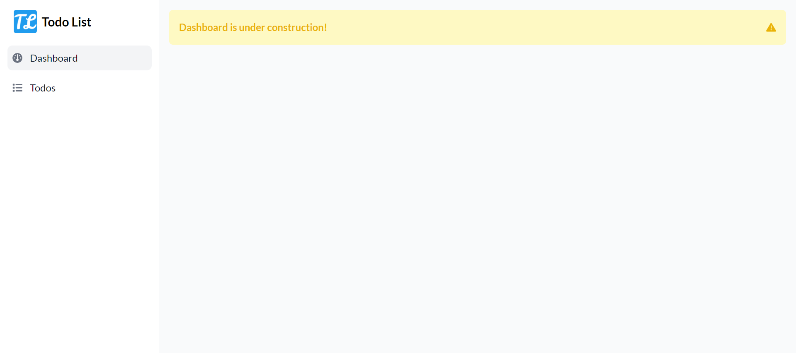
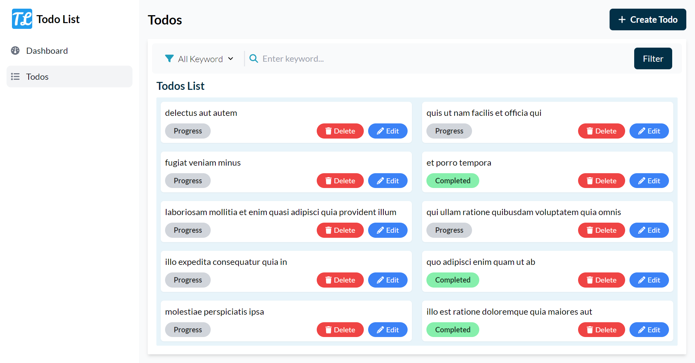
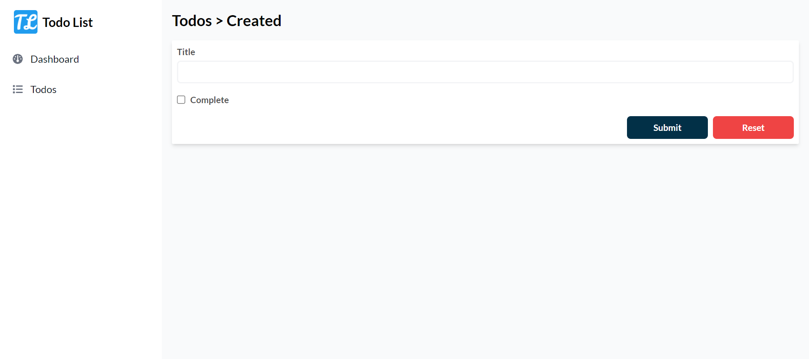

<h3 align="center">Todo List App</h3>

### Built With

- [ReactJS v18.2.0](https://spring.io/)
- [NodeJS 20](https://www.oracle.com/java/technologies/javase/jdk17-archive-downloads.html)
- [Randommer.io](https://randommer.io/)
- [Typescript](https://www.typescriptlang.org/)
- [Redux](https://redux.js.org/)
- [Redux Saga](https://www.typescriptlang.org/)

### Prerequisites

This is an example of how to list things you need to use the software and how to install them.

- Text Editor
- NodeJS
- PNPM

### Installation

1. Clone the repo
         https://github.com/Myudhaap/todo-list-react-ts
   
2. Install package dependencies

        pnpm install
   

3. Run the app

        pnpm vite
   

### Screenshots App

<!-- CONTACT -->

## Contact

Muhammad Yudha Adi Pratamma -
Instagram - [@myudha_ap](https://instagram.com/myudha_ap)

Project Link: [https://github.com/Myudhaap/todo-list-react-ts](httpshttps://github.com/Myudhaap/todo-list-react-tsreact)
